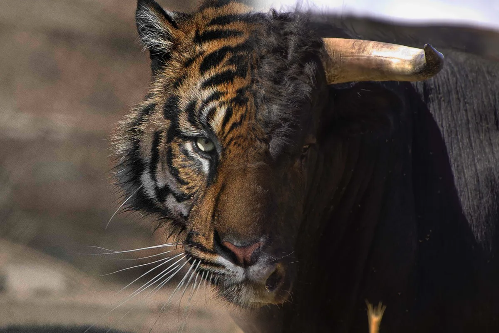

# CS180 Project Portfolio

This repository contains my project write-ups for **CS180 (Computer Vision & Computational Photography)**.  
Each project is presented as a self-contained website with explanations, figures, and results.

The projects progress from **camera geometry and classical vision** to **3D neural representations** and **modern generative models**, emphasizing both conceptual understanding and implementation.

**[Live Project Index (GitHub Pages)](https://eduardo1100.github.io/CS180/)**

---

## Projects Overview
### Project 0: Becoming Friends with Your Camera

#### Topics: Perspective, focal length, center of projection

Three mini-studies exploring how camera geometry affects appearance:
- Close-up selfie vs stepped-back zoomed portrait
- Perspective compression along a street
- A dolly zoom (Vertigo shot) constructed from still images
- Focus: understanding viewing geometry while keeping subject scale roughly constant.

📂 ./0/index.html

### Project 1: Images of the Russian Empire (Prokudin-Gorskii)

#### Topics: Image alignment, NCC, image pyramids

Digitized glass-plate photographs are reconstructed into RGB images by:
- Extracting B/G/R channels
- Aligning channels via translation
- Scoring alignment with normalized cross-correlation (NCC)
- Refining alignment using a coarse-to-fine pyramid
- Displacement vectors for each channel are reported.

📂 ./1/index.html

### Project 2: Fun with Filters & Frequencies

#### Topics: Convolution, edges, frequency decomposition

This project explores:
- 2D convolution from scratch
- Finite-difference gradients and DoG
- Unsharp masking
- Hybrid images (Oliva–Torralba–Schyns)
- Multi-resolution blending using Gaussian/Laplacian stacks and mask pyramids

📂 ./2/index.html

### Project 3: Planar Rectification, Mosaics & Automatic Stitching

#### Topics: Homographies, feature matching, RANSAC

A combined write-up covering:
- 3A: Manual correspondences → homography → inverse warping → mosaics
- 3B: Fully automatic pipeline with:
  - Corner detection
  - Patch descriptors
  - Ratio-test matching
  - RANSAC homography estimation
  - Warping and blending

The final result is an end-to-end panorama stitching system.

📂 Canonical: ./3B/index.html

### Project 4: Neural Radiance Fields (NeRF)

#### Topics: Continuous 3D representations, volumetric rendering

Starting from raw phone images, this project builds a NeRF pipeline:
- Camera calibration and pose estimation
- 2D neural field warm-up
- Training a NeRF on the Lego dataset
- Training a NeRF on a custom object

NeRF represents scenes as a continuous function mapping 3D position and view direction to color and density, rendered via ray integration.

📂 ./4/index.html

### Project 5: Diffusion Models & Flow Matching UNets

#### Topics: Generative modeling, diffusion, UNets

Two complementary perspectives on the same core problem: noise → image.
- Part A (5A): Using a pretrained diffusion model
  - Implement the full sampling loop
  - Add Classifier-Free Guidance (CFG)
  - Image editing via SDEdit and inpainting
  - Visual anagrams and creative hybrids

- Part B (5B): Training the denoiser
  - Train a UNet as a single-step denoiser (σ = 0.5)
  - Test generalization to OOD noise levels
  - Train flow matching UNets to learn velocity fields
  - Add time and class conditioning with CFG for digit control
 

📂 Canonical: ./5B/index.html
